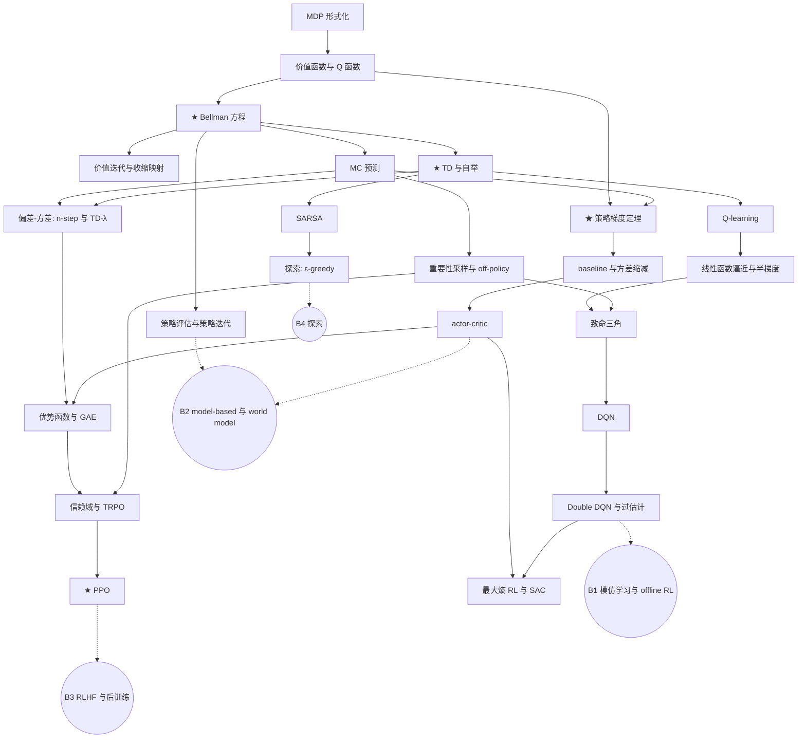

# 概念依赖图 v0

主干是所有方向共享的基础，分支暂时只作占位，确定方向后再展开。★ 表示核心节点，要求 L3（能实现）；其余节点要求 L2（能推导）。

参考资料缩写：SB = Sutton & Barto《Reinforcement Learning: An Introduction》第 2 版；DS = David Silver UCL 课程；CS285 = Berkeley CS285（按讲座主题引用）。

## 主干节点

### 阶段 1：表格方法基础

| 节点 | 前置 | 要求 | 参考 |
| --- | --- | --- | --- |
| S1.1 MDP 形式化：状态、动作、转移、奖励、回报、折扣 | 无 | L2 | SB 第 3 章；DS 第 2 讲 |
| S1.2 价值函数与 Q 函数 | S1.1 | L2 | SB 3.5–3.6；DS 第 2 讲 |
| S1.3 ★ Bellman 期望方程与最优方程 | S1.2 | L3 | SB 3.5–3.6；DS 第 2 讲 |
| S1.4 策略评估与策略迭代 | S1.3 | L2 | SB 4.1–4.3；DS 第 3 讲 |
| S1.5 价值迭代与收缩映射 | S1.3 | L2 | SB 4.4；DS 第 3 讲 |

### 阶段 2：无模型预测与控制

| 节点 | 前置 | 要求 | 参考 |
| --- | --- | --- | --- |
| S2.1 MC 预测 | S1.3 | L2 | SB 5.1；DS 第 4 讲 |
| S2.2 ★ TD(0) 与自举 | S1.3 | L3 | SB 6.1–6.3；DS 第 4 讲 |
| S2.3 偏差-方差：n-step 与 TD(λ) | S2.1, S2.2 | L2 | SB 第 7、12 章；DS 第 4 讲 |
| S2.4 SARSA（on-policy 控制） | S2.2 | L2 | SB 6.4；DS 第 5 讲 |
| S2.5 Q-learning（off-policy 控制） | S2.2 | L2 | SB 6.5；DS 第 5 讲 |
| S2.6 探索：ε-greedy | S2.4 | L2 | SB 第 2 章、5.4；DS 第 5 讲 |
| S2.7 重要性采样与 off-policy 评估 | S2.1 | L2 | SB 5.5；DS 第 5 讲 |

### 阶段 3：函数逼近

| 节点 | 前置 | 要求 | 参考 |
| --- | --- | --- | --- |
| S3.1 线性函数逼近与半梯度方法 | S2.5 | L2 | SB 第 9 章；DS 第 6 讲 |
| S3.2 致命三角：函数逼近 + 自举 + off-policy | S3.1, S2.7 | L2 | SB 11.3 |
| S3.3 DQN：经验回放与目标网络 | S3.2 | L2 | CS285 value function / deep Q 讲；Mnih et al. 2015 |
| S3.4 Double DQN 与 Q 值过估计 | S3.3 | L2 | van Hasselt et al. 2016 |

### 阶段 4：策略梯度

| 节点 | 前置 | 要求 | 参考 |
| --- | --- | --- | --- |
| S4.1 ★ 策略梯度定理与 REINFORCE | S1.2, S2.1 | L3 | SB 13.1–13.3；CS285 policy gradients 讲；DS 第 7 讲 |
| S4.2 baseline 与方差缩减 | S4.1 | L2 | SB 13.4；CS285 policy gradients 讲 |
| S4.3 actor-critic | S4.2 | L2 | SB 13.5；CS285 actor-critic 讲 |
| S4.4 优势函数与 GAE | S2.3, S4.3 | L2 | CS285 actor-critic 讲；Schulman et al. 2016 |

### 阶段 5：现代算法

| 节点 | 前置 | 要求 | 参考 |
| --- | --- | --- | --- |
| S5.1 信赖域思想与 TRPO | S4.4, S2.7 | L2 | CS285 advanced policy gradients 讲；Schulman et al. 2015 |
| S5.2 ★ PPO：clip 目标 | S5.1 | L3 | Schulman et al. 2017 |
| S5.3 最大熵 RL 与 SAC | S4.3, S3.4 | L2 | Haarnoja et al. 2018 |

## 分支占位

确定方向后再展开为完整子图。当前只记录入口节点。

| 分支 | 入口节点 | 展开时的起点 |
| --- | --- | --- |
| B1 模仿学习与 offline RL | S3.4 | 行为克隆的分布偏移 → offline RL 中的 Q 值高估 |
| B2 model-based 与 world model | S1.4, S4.3 | Dyna（SB 第 8 章）→ 在学到的模型里做 actor-critic |
| B3 RLHF 与后训练 | S5.2 | 奖励模型 → 带 KL 约束的 PPO |
| B4 探索 | S2.6 | ε-greedy 的局限 → 内在奖励 |
