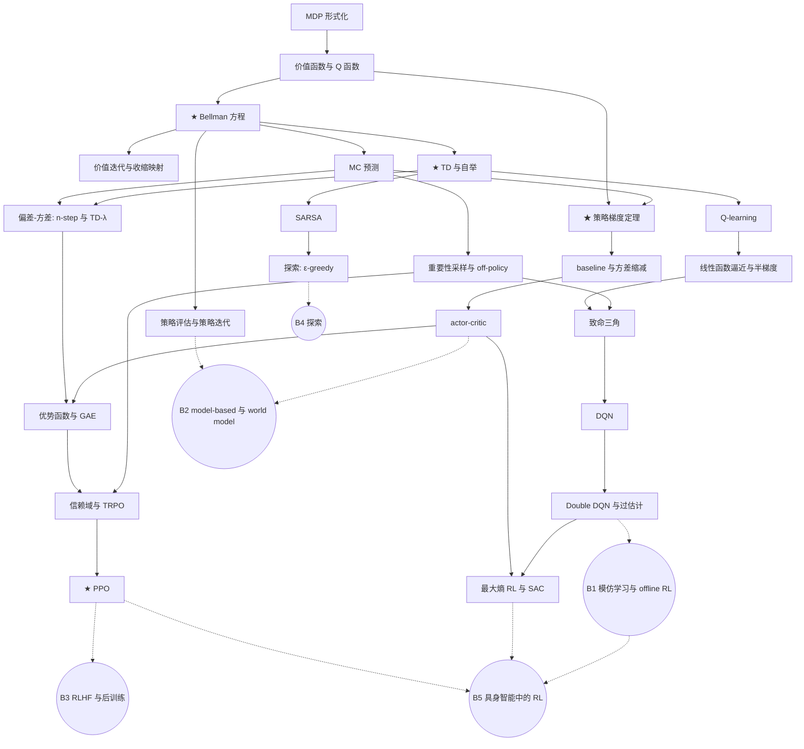

# 概念依赖图 v0

主干是所有方向共享的基础，分支暂时只作占位，确定方向后再展开。★ 表示要求 L3 的节点。

> 2026-10-02 起按协议 v1.1：每个节点标了档位（深入 / 理解 / 了解），档位决定教学方式，要求列写成“档位 · 等级”。理由见 `plan.md` 调整记录。
> - 深入：三个目标方向（大模型后训练、端到端驾驶、具身智能）共用的主线，要求 L2b 或 L3，括号里写明核心推导。
> - 理解：讲解为主，要求 L2a 能解释。
> - 了解：讲解为主，要求 L1，记住定性结论和公式的作用。
> - 等级定义：L1 能预测；L2a 能解释；L2b 能推导（只用于核心推导）；L3 能实现（共写，核心公式由学习者实现，能解释失败现象）。

参考资料缩写：SB = Sutton & Barto《Reinforcement Learning: An Introduction》第 2 版；DS = David Silver UCL 课程；CS285 = Berkeley CS285（按讲座主题引用）。

```mermaid
graph TD
  S1.1[MDP 形式化] --> S1.2[价值函数与 Q 函数]
  S1.2 --> S1.3[★ Bellman 方程]
  S1.3 --> S1.4[策略评估与策略迭代]
  S1.3 --> S1.5[价值迭代与收缩映射]
  S1.3 --> S2.1[MC 预测]
  S1.3 --> S2.2[★ TD 与自举]
  S2.1 --> S2.3[偏差-方差: n-step 与 TD-λ]
  S2.2 --> S2.3
  S2.2 --> S2.4[SARSA]
  S2.2 --> S2.5[Q-learning]
  S2.4 --> S2.6[探索: ε-greedy]
  S2.1 --> S2.7[重要性采样与 off-policy]
  S2.5 --> S3.1[线性函数逼近与半梯度]
  S3.1 --> S3.2[致命三角]
  S2.7 --> S3.2
  S3.2 --> S3.3[DQN]
  S3.3 --> S3.4[Double DQN 与过估计]
  S1.2 --> S4.1[★ 策略梯度定理]
  S2.1 --> S4.1
  S4.1 --> S4.2[baseline 与方差缩减]
  S4.2 --> S4.3[actor-critic]
  S2.3 --> S4.4[优势函数与 GAE]
  S4.3 --> S4.4
  S4.4 --> S5.1[信赖域与 TRPO]
  S2.7 --> S5.1
  S5.1 --> S5.2[★ PPO]
  S4.3 --> S5.3[最大熵 RL 与 SAC]
  S3.4 --> S5.3

  S3.4 -.-> B1((B1 模仿学习与 offline RL))
  S1.4 -.-> B2((B2 model-based 与 world model))
  S4.3 -.-> B2
  S5.2 -.-> B3((B3 RLHF 与后训练))
  S2.6 -.-> B4((B4 探索))
  S5.2 -.-> B5((B5 具身智能中的 RL))
  S5.3 -.-> B5
  B1 -.-> B5
```

## 主干节点

### 阶段 1：表格方法基础

| 节点 | 前置 | 要求 | 参考 |
| --- | --- | --- | --- |
| S1.1 MDP 形式化：状态、动作、转移、奖励、回报、折扣 | 无 | 理解 · L2a | SB 第 3 章；DS 第 2 讲 |
| S1.2 价值函数与 Q 函数 | S1.1 | 理解 · L2a | SB 3.5–3.6；DS 第 2 讲 |
| S1.3 ★ Bellman 期望方程与最优方程 | S1.2 | 深入 · L3 | SB 3.5–3.6；DS 第 2 讲 |
| S1.4 策略评估与策略迭代 | S1.3 | 深入 · L2b（策略改进定理） | SB 4.1–4.3；DS 第 3 讲 |
| S1.5 价值迭代与收缩映射 | S1.3 | 理解 · L2a（读懂收缩映射论证） | SB 4.4；DS 第 3 讲 |

### 阶段 2：无模型预测与控制

| 节点 | 前置 | 要求 | 参考 |
| --- | --- | --- | --- |
| S2.1 MC 预测 | S1.3 | 理解 · L2a | SB 5.1；DS 第 4 讲 |
| S2.2 ★ TD(0) 与自举 | S1.3 | 深入 · L3 | SB 6.1–6.3；DS 第 4 讲 |
| S2.3 偏差-方差：n-step 与 TD(λ) | S2.1, S2.2 | 深入 · L2b（TD 与 MC 的偏差-方差） | SB 第 7、12 章；DS 第 4 讲 |
| S2.4 SARSA（on-policy 控制） | S2.2 | 了解 · L1 | SB 6.4；DS 第 5 讲 |
| S2.5 Q-learning（off-policy 控制） | S2.2 | 理解 · L2a | SB 6.5；DS 第 5 讲 |
| S2.6 探索：ε-greedy | S2.4 | 了解 · L1 | SB 第 2 章、5.4；DS 第 5 讲 |
| S2.7 重要性采样与 off-policy 评估 | S2.1 | 深入 · L2b（重要性采样比） | SB 5.5；DS 第 5 讲 |

### 阶段 3：函数逼近

| 节点 | 前置 | 要求 | 参考 |
| --- | --- | --- | --- |
| S3.1 线性函数逼近与半梯度方法 | S2.5 | 理解 · L2a | SB 第 9 章；DS 第 6 讲 |
| S3.2 致命三角：函数逼近 + 自举 + off-policy | S3.1, S2.7 | 理解 · L2a | SB 11.3 |
| S3.3 DQN：经验回放与目标网络 | S3.2 | 了解 · L1 | CS285 value function / deep Q 讲；Mnih et al. 2015 |
| S3.4 Double DQN 与 Q 值过估计 | S3.3 | 理解 · L2a（只要求过估计机制：max 为什么带来正偏差；Double DQN 细节 L1） | van Hasselt et al. 2016 |

### 阶段 4：策略梯度

| 节点 | 前置 | 要求 | 参考 |
| --- | --- | --- | --- |
| S4.1 ★ 策略梯度定理与 REINFORCE | S1.2, S2.1 | 深入 · L3（含 L2b：策略梯度定理；含连续动作的高斯策略） | SB 13.1–13.3；CS285 policy gradients 讲；DS 第 7 讲 |
| S4.2 baseline 与方差缩减 | S4.1 | 深入 · L2b（baseline 不引入偏差） | SB 13.4；CS285 policy gradients 讲 |
| S4.3 actor-critic | S4.2 | 理解 · L2a | SB 13.5；CS285 actor-critic 讲 |
| S4.4 优势函数与 GAE | S2.3, S4.3 | 深入 · L2b（GAE 是 TD 残差的指数加权和） | CS285 actor-critic 讲；Schulman et al. 2016 |

### 阶段 5：现代算法

| 节点 | 前置 | 要求 | 参考 |
| --- | --- | --- | --- |
| S5.1 信赖域思想与 TRPO | S4.4, S2.7 | 理解 · L2a | CS285 advanced policy gradients 讲；Schulman et al. 2015 |
| S5.2 ★ PPO：clip 目标 | S5.1 | 深入 · L3（含 L2b：clip 的分情况分析） | Schulman et al. 2017 |
| S5.3 最大熵 RL 与 SAC | S4.3, S3.4 | 理解 · L2a（最大熵目标的作用；真机训练为什么偏向 off-policy；双 Q 与过估计的关系。最大熵最优策略 π*∝exp(Q/α) 仍并入核心推导“KL 正则目标的最优解”） | Haarnoja et al. 2018 |

## 分支占位

确定方向后再展开为完整子图。当前只记录入口节点。

| 分支 | 入口节点 | 展开时的起点 |
| --- | --- | --- |
| B1 模仿学习与 offline RL | S3.4 | 行为克隆的分布偏移 → offline RL 中的 Q 值高估 |
| B2 model-based 与 world model | S1.4, S4.3 | Dyna（SB 第 8 章）→ 在学到的模型里做 actor-critic |
| B3 RLHF 与后训练 | S5.2 | 奖励模型 → 带 KL 约束的 PPO |
| B4 探索 | S2.6 | ε-greedy 的局限 → 内在奖励 |
| B5 具身智能中的 RL | S5.2, S5.3, B1 | 并行仿真中的 PPO → sim-to-real 与域随机化 → 机器人奖励设计 → 在模仿策略上用 RL 微调 |
